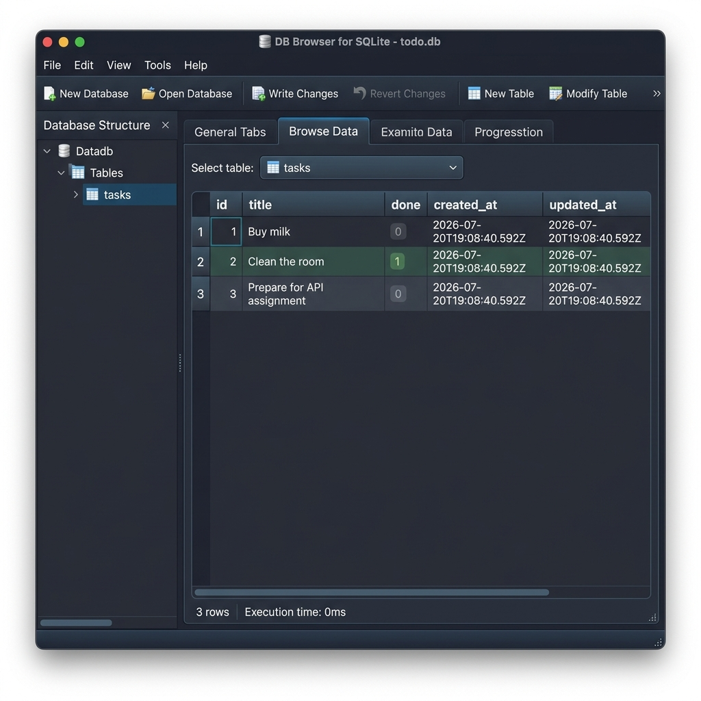

# Tiny Backend

A simple backend server built with Node.js and Express. It now includes a fully functional Task CRUD API backed by a SQLite database.

## Features

- JSON API endpoint: `/` (Welcome message)
- JSON API endpoint: `/about` (Project metadata)
- Task CRUD API:
  - `GET /tasks` - Retrieve all tasks (supports query filters `search`, `done`, and `sort`)
  - `GET /tasks/:id` - Retrieve a task by ID
  - `POST /tasks` - Create a new task (validates that `title` is provided)
  - `PUT /tasks/:id` - Update a task's title and/or done status
  - `DELETE /tasks/:id` - Delete a task by ID
  - `GET /stats` - Retrieve task stats (total, completed, pending) using SQL aggregate functions

## Database Integration (SQLite)

### Why SQLite was chosen
SQLite was chosen because:
- **Serverless & Lightweight:** It requires no setup, installation, or running background server processes.
- **Single File Storage:** The entire database resides in a single file (`tasks.db`) in the project directory, which makes it highly portable and easy to version control or share.
- **Zero Configuration:** It is automatically created and seeded on the first boot, making it perfect for rapid local development.

### Database Location
The database is stored in the project root folder as:
`tasks.db`

### Screenshot of Database Viewer
Here is a screenshot of the `tasks` table inside the database, viewed using **DB Browser for SQLite**:



### Example SQL Queries Executed
To list every task in the database:
```sql
SELECT * FROM tasks;
```

To see only completed tasks:
```sql
SELECT * FROM tasks WHERE done = 1;
```

To count all tasks:
```sql
SELECT COUNT(*) FROM tasks;
```

To mark every task as completed:
```sql
UPDATE tasks SET done = 1;
```

To delete all completed tasks:
```sql
DELETE FROM tasks WHERE done = 1;
```

## Technologies Used

- Node.js
- Express.js
- SQLite (via `better-sqlite3` library)

## Installation

Clone the repository:

```bash
git clone https://github.com/gaurii-9/tiny-backend.git
```

Navigate to the project folder:

```bash
cd tiny-backend
```

Install dependencies:

```bash
npm install
```

## Run the Server

```bash
npm start
```

On the first run, the SQLite database `tasks.db` and the `tasks` table will be created automatically. If the table is empty, it will be seeded with three example tasks.

The server will start at:

```
http://localhost:3000
```

## Author

Gauri

GitHub: https://github.com/gaurii-9
